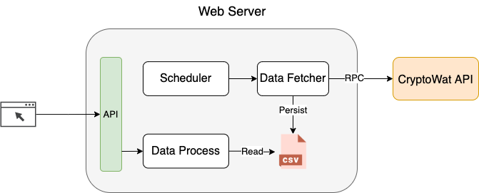

# BTC Price Tracker
## Features:
- Checkbox on the top-left corner to select or multi-select the currency to show
- Graphs with btc in different currencies as selected in the past 24h
- A table of standard deviation of each currency and the ranking


# How to install and run locally

1. Download the repo
```
git clone https://github.com/bjjiangfs/price-tracker.git
```

2. Install bokeh
```
pip install bokeh
```

3. Cd into the repo and run the webserver
```
cd price-tracker; bokeh serve --show app.py
```

A tab should pop up in your browser, if not manually go to http://localhost:5006/app

## MVP Design:
The price tracker has the following component:
- Scheduler: it allows scheduling different currency at different rpc call cadence, for example, here we register `btceur` and `btcusd` both at 10 second interval
- Data Fetcher: it does the RPC call to the cryptowat REST API, validate response and persist the data into a csv file
- CSV file: as MVP, csv is the easiest way to store data, the file is organized in buckets like `/data/<currency>/<YYYY-MM-DD-HH>.csv`. This makes fetching data for past 24h faster. For exampe:
  - `/data/btceur/2021-10-30-15.csv` has the data fetched from 15:00 to 15:59 on Oct 30th
  - `/data/btcuds/2021-10-30-16.csv`
- Data Processor: it reads data from csv files with a given time range, calculate standard deviation and ranking, expose API for UI to consume


## Future Work
- Add unit tests & integration tests
- Make RPC call more reliable with retry logic and better error handling
- Make file bucket with finer gradularity, something like `/data/btceur/YYYY-MM-DD/HH/mm/<filename>.csv`, so that the system will allow stats for smaller time range like std of past 10min. It is also faster and more accurate when reading data with a given range.
- Move csv file to S3 instead of in local machine. 
  - Could also switch from csv to a relational DB for sharding and indexing
- Exisiting system read data for past 24h every time which is suboptimal, better way would be store the data read in a cache, every time we want to refresh the graph, only fetch the new data by setting the time range to be [most_recent_datetime in cache, current_datetime]

## Scalability
MVP design is not going to scale with more types of currency and more frequent data fetching, because the scheduler will quickly use up the CPU cycles.

Scalability: what would you change if you needed to track many metrics? What if you needed to sample them more frequently? what if you had many users accessing your dashboard to view metrics?
Testing: how would you extend testing for an application of this kind (beyond what you implemented)?
Feature request: to help the user identify opportunities in real-time, the app will send an alert whenever a metric exceeds 3x the value of its average in the last 1 hour. For example, if the volume of GOLD/BTC averaged 100 in the last hour, the app would send an alert in case a new volume data point exceeds 300. Please write a short proposal on how you would implement this feature request.
