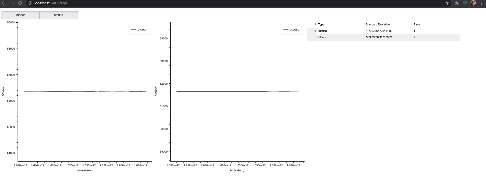

# BTC Price Tracker
## Features:
- Checkbox on the top-left corner to select or multi-select the currency to show
- Graphs with btc in different currencies as selected in the past 24h
- A table of standard deviation of each currency and the ranking


# How to install and run locally

1. Download the repo
```
git clone https://github.com/bjjiangfs/price-tracker.git
```

2. Install bokeh
```
pip install bokeh
```

3. Cd into the repo and run the webserver
```
cd price-tracker; bokeh serve --show app.py
```

A tab should pop up in your browser, if not manually go to http://localhost:5006/app

## MVP Design:


Scalability: what would you change if you needed to track many metrics? What if you needed to sample them more frequently? what if you had many users accessing your dashboard to view metrics?
Testing: how would you extend testing for an application of this kind (beyond what you implemented)?
Feature request: to help the user identify opportunities in real-time, the app will send an alert whenever a metric exceeds 3x the value of its average in the last 1 hour. For example, if the volume of GOLD/BTC averaged 100 in the last hour, the app would send an alert in case a new volume data point exceeds 300. Please write a short proposal on how you would implement this feature request.
